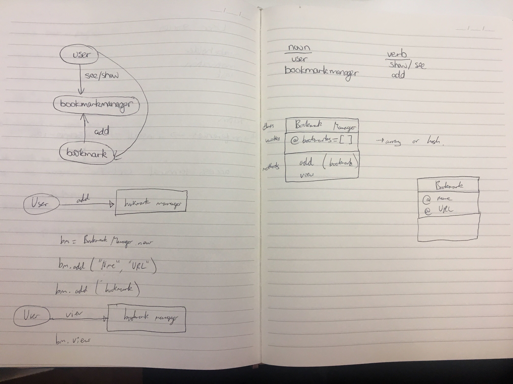

# Bookmark Manager

Makers Academy Module 6 - [Databases](https://github.com/makersacademy/course/blob/master/apprenticeship_module_outlines.md#module-6-databases), afternoon challenge [Bookmark Manager](https://github.com/makersacademy/course/tree/master/bookmark_manager)

# User Stories
```
As a user
So that I can see my favourite websites
I would like to see a list of my bookmarks

As a user
So that I don't forget my favourite websites
I would like to add new bookmarks
```

# Domain Model Diagram

Click link to see what the domain model should look like [domain-model_2](https://github.com/makersacademy/course/blob/master/bookmark_manager/images/bookmark_manager_1.png)
